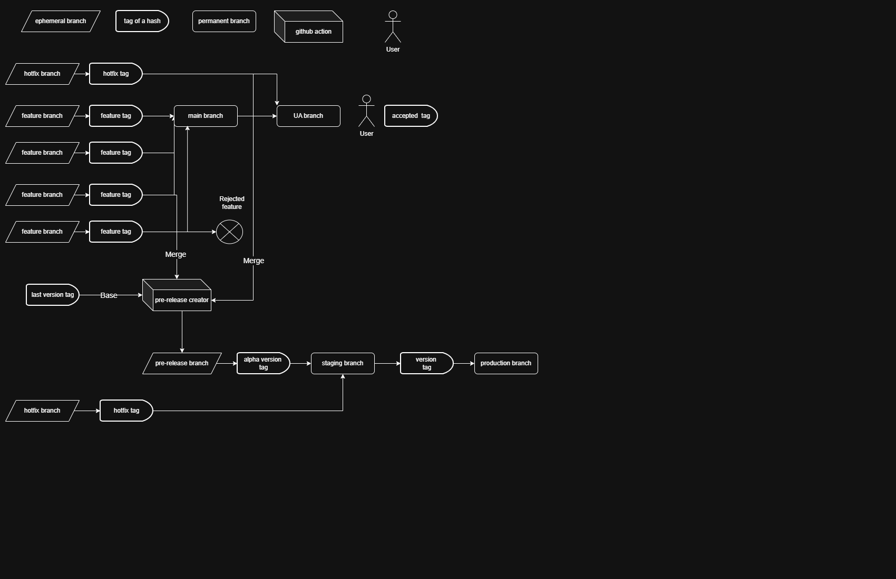

# Country Stats

This is a showcase project that gives statistics about countries  through Azure Databricks and Power Bi with basic open source apis.

The aim of this project is to show what improvements can be made on other projects.

## Table of content:

## Dev container for VS Code

With developer container the users can have an exact setup that is ready after they opened the repository / workspace. Devcontainers can be used with other IDEs, this one is made for VS Code in mind. It downloads the programs neccessary to work (such as python, git graph etc…), runs a post script to install everything needed such as python requirements and node modules, Downloads the VS Code extensions and configures them. 

This will make sure that everyone works from the same setup if they chose to do so. You can still use your own other Extensions ( such as Material Icon Theme). With the.devcontainer.json other IDEs can also be added to work with. Developers can opt-out from using this and disable it, then they have to make sure their own local environment works with the repository as intended.

### Install guide:

1. Download  and install Git: [https://git-scm.com/install/](https://git-scm.com/install/)
2. Download and install VS Code: [https://code.visualstudio.com/download](https://code.visualstudio.com/download)
3. If Windows is used install WSL powershell:  `wsl --install`
4. Download and install Docker Desktop (or just simple docker CLI) : [https://docs.docker.com/desktop/setup/install/windows-install/](https://docs.docker.com/desktop/setup/install/windows-install/)
5. Open Docker Desktop and in settings/general - Start Docker Desktop when you sign in to your computer = true
6. Open VS Code
7. Download this repository: [https://github.com/levayzsombor/cs-databricks](https://github.com/levayzsombor/cs-databricks)
8. Add the Dev Containers extension to VS Code: ms-vscode-remote.remote-containers
9. Either click on the pop-up to start the container or ctrl + shift + P -> Dev containers: Rebuild and Reload container

### Installed programs:

1. Git
2. Azure-CLI
3. Copilot-CLI
4. Node : for Eslint and Prettier
5. Shellcheck : for shell linting
6. shfmt: for shell formatting
7. actionlint: for github actions linting
8. yamlfmt: for yaml formatting

### Installed extensions:

1. Git graph: a visual helper for git branches
2. Git blame: can see inline the last change
3. Git History: an easy visual way to check file and commit history
4. YAML: yaml language support
5. Ruff: Python linter and formatter while coding
6. TY: Python type checker while coding
7. Jupyter: for notebooks
8. EchoAPI: Postman like Rest API program
9. Databricks: Connect to a databricks environment
10. GitHub Actions: see the GHA running on the repo
11. GitHub Pull Request: create and handle pull requests in VS Code
12. GitHub repositories: Browse GitHub repos without checkout
13. GitHub Copilot: enable copilot inside the container
14. GitHub Copilot chat: chat window for Copilot
15. GitHub Actions (YAML): YAML schema validation
16. Prettier: default formatter (python, and shell not included)
17. Bash IDE: shell script linting and formatting while coding
18. Code Spell Checker: Spell checking for for .MD files and strings
19. Markdown Editor: Helps editing .MD files in a Preview format (Right-click edit with markdown editor)

## Git Branching strategy and deployment

### Branches and tags graph

### Explanation of branches and tags

Git branching strategies combining Git Rules ( for branches and tags ), GitHub Actions and Permissions help create an orderly merge for code making sure the protected branched have their intended version of the code.
With the same GitHub Actions the Deployment and updates of the Azure applications can be started to make it automatic.

The basic idea is to have 5 protected branches: main (default), ua, staging, prod as permanent branches and pre-release ephemeral branch. merges into these branches are with strict rules and uses tags on commits to track features and versions.

**hot fix** branches can be created that can merge into the **ua**, **pre-release** and **staging** branch with a PR (and senior approval). At the commit hash a _**hot fix**_ tag is created. WARNING! There is no check of what code for example other features are included this code, anything from here can go into the approved protected branches. A senior Approval should be needed at the PR for this

Development happens in **feature branches** that create _**tag**_ at the commit hash when merging to see what feature its part of ex: tag: _**feature-import-update**_. This code merge into **main** where it's together with the other improvements and tested. GitHub Action automatically updates the **DEV** Azure application with the code. It can only merge into **main** and **pre-release**. Before merging it into **main** there is a forced rebase of the branch. The reason for this is while in a normal setup merging the current **main** branch HEAD into the **feature** branch is the same as rebasing since the PR checks the difference between the two codes, in this case its critical to only have the feature code at the point of the tag creation and nothing else. If the code is merged into it instead of rebased other features codes will be included in the tag tainting it. 

When **main** is ready it merges with a PR into **ua** (user acceptance) with a PR that provides a list of all the _**feature**_ tags that is included in it. GitHub Action updates the **UA** Azure application automatically with the new code.

After user acceptance is done the approved _**features**_ and _**hot fixes**_ all merge into a **pre-release** branch its base being the last _**version**_ tag (where **prod** merged back into **main**) via a GitHub action. A pre-release PR is created that has an incrementing _**version-alpha**_ tag ex: _**version-1.0.5-alpha**_ that is merged into the **staging** branch. This is automated by a GitHub Action.

This **staging** branch have a chance to be broken since not all the code from **main** was merged into it, if there were _**features**_ excluded. This can be repaired and run in the staging environment until the tests pass with the new PR. Since its separated from **main** development can continue on **main** while the validation is ongoing. All repos go with the same _**version**_ so staging check can only pass if all the repositories are on the same _**version**_. If a repository doesn't need new code for the version the _**version**_ tag is added next to the old one.

After this a release PR is created from **staging** with the _**version**_ tag (alpha removed) that lists all _**feature**_ tags and **hot fixes** that was included, and merge into the **prod** protected branch. GitHub action automatically updates the inactive **PROD** Azure application. In Blue - Green deployment there is an active **PROD** application and an inactive one. Since its cloud the inactive doesn't cost resources. When the inactive **PROD** application activates Users can test it to their needs. if accepted it takes on the main **PROD** application role and the old version goes inactive (can be started up if there is an issue with the new one). After this a PR is created from the _**version**_ tag and merged with a PR into main updating the version number and realigning it with the hot fixes made before.

### Git Branches:

Protected means a PR is needed in order to merge into the branch.
a Squash merge is recommended for all branches by default

1. Feature branch (not protected):

   - Newly created branch for each feature
   - Any branch can be merged into it
   - Can only merge to the **main** protected branch with a PR
   - Needs a _**feature-(name)**_ tag to merge
   - Mandatory rebase to current **main** branch HEAD before merging it into it

2. Hotfix branch (not protected):

   - Newly created branch for each hotfix
   - Any branch can merge into it
   - Can only merge into **main**, **ua**, **pre-release** and **staging** protected branch with a PR
   - Needs a _**hotfix-(name)**_ tag to merge

3. Main branch (default, protected):

   - Permanent branch for development
   - Only **feature**, **hotfix** and **prod** branches can merge into it
   - Checks if **feature** branch is rebased to **main** branch current HEAD before merge
   - Can only merge into **ua** protected branch with a PR

4. Ua branch (user acceptance, protected)

   - Permanent branch for UA
   - Only **main** and **hotfix** branches can merge into it
   - Can't merge into anything

5. Pre-release branch (not protected):

   - Newly created branch for each pre-release
   - Only **feature** and **hotfix** branches can merge into it
   - Has a pre-push check that blocks all code changes if its not coming from a **feature** or **hotfix** branch
   - Can only merge into **staging** protected branch with a PR
   - Needs a _**version-(number)-alpha**_ tag to merge

6. Staging branch (protected):

   - Permanent branch for staging
   - Only **pre-release** and **hot-fix** branches can merge into it
   - Can only merge into **prod** protected branch with a PR
   - Needs a _**version-(number)**_ tag to merge

7. Prod branch (protected):

   - Permanent branch for production
   - Only **staging** branch can merge into it
   - Can only merge into **main** protected branch with a PR

### Environments:

There are 5 environments that maintain a Databricks Azure Application. Since the code only needs to be pulled into the application no deployment is needed unless the application is dormant.

1. Dev

   - The **main**, **feature**, and **hot-fix** branches can be here to check them

2. UA

   - **ua** branch is here

3. Staging

   - **staging** branch is here 

4. Prod (Blue)

   - **prod** current version is here
   - active

5. Prod (Green)

   - **prod** old version is here
   - dormant
   - can be updated with a newer **prod** version
