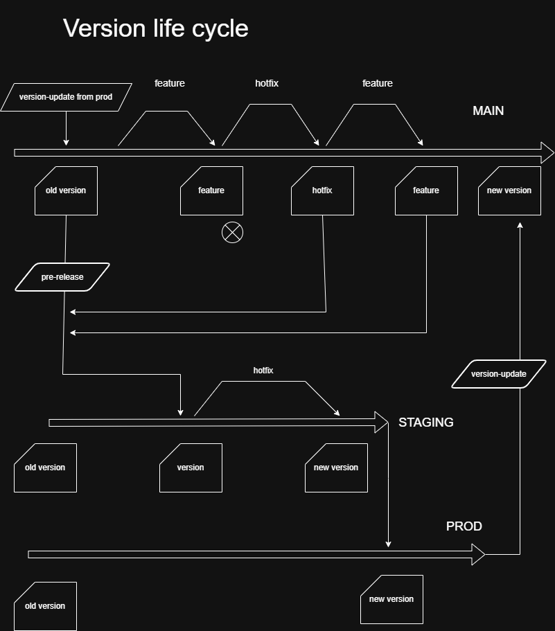

# Country Stats

This is a showcase project that gives statistics about countries  through Azure Databricks and Power Bi with basic open source apis.

The aim of this project is to show what improvements can be made on other projects.

## Table of content:

## Dev container for VS Code

With developer container the users can have an exact setup that is ready after they opened the repository / workspace. Devcontainers can be used with other IDEs, this one is made for VS Code in mind. It downloads the programs neccessary to work (such as python, git graph etc…), runs a post script to install everything needed such as python requirements and node modules, Downloads the VS Code extensions and configures them. 

This will make sure that everyone works from the same setup if they chose to do so. You can still use your own other Extensions ( such as Material Icon Theme). With the.devcontainer.json other IDEs can also be added to work with. Developers can opt-out from using this and disable it, then they have to make sure their own local environment works with the repository as intended.

### Install guide:

1. Download  and install Git: [https://git-scm.com/install/](https://git-scm.com/install/)
2. Download and install VS Code: [https://code.visualstudio.com/download](https://code.visualstudio.com/download)
3. If Windows is used install WSL powershell:  `wsl --install`
4. Download and install Docker Desktop (or just simple docker CLI) : [https://docs.docker.com/desktop/setup/install/windows-install/](https://docs.docker.com/desktop/setup/install/windows-install/)
5. Open Docker Desktop and in settings/general - Start Docker Desktop when you sign in to your computer = true
6. Open VS Code
7. Download this repository: [https://github.com/levayzsombor/cs-databricks](https://github.com/levayzsombor/cs-databricks)
8. Add the Dev Containers extension to VS Code: ms-vscode-remote.remote-containers
9. Either click on the pop-up to start the container or ctrl + shift + P -> Dev containers: Rebuild and Reload container

### Installed programs:

1. Git
2. Azure-CLI
3. Copilot-CLI
4. Node : for Eslint and Prettier
5. Shellcheck : for shell linting
6. shfmt: for shell formatting
7. actionlint: for github actions linting
8. yamlfmt: for yaml formatting

### Installed extensions:

1. Git graph: a visual helper for git branches
2. Git blame: can see inline the last change
3. Git History: an easy visual way to check file and commit history
4. YAML: yaml language support
5. Ruff: Python linter and formatter while coding
6. TY: Python type checker while coding
7. Jupyter: for notebooks
8. EchoAPI: Postman like Rest API program
9. Databricks: Connect to a databricks environment
10. GitHub Actions: see the GHA running on the repo
11. GitHub Pull Request: create and handle pull requests in VS Code
12. GitHub repositories: Browse GitHub repos without checkout
13. GitHub Copilot: enable copilot inside the container
14. GitHub Copilot chat: chat window for Copilot
15. GitHub Actions (YAML): YAML schema validation
16. Prettier: default formatter (python, and shell not included)
17. Bash IDE: shell script linting and formatting while coding
18. Code Spell Checker: Spell checking for for .MD files and strings
19. Markdown Editor: Helps editing .MD files in a Preview format (Right-click edit with markdown editor)

## Git Branching strategy and deployment

### Version lifecycle:

### Explanation of branches and tags

Git branching strategies combining Git Rules ( for branches and tags ), GitHub Actions and Permissions help create an orderly merge for code making sure the protected branched have their intended version of the code.
With the same GitHub Actions the Deployment and updates of the Azure applications can be started to make it automatic.

The basic idea is to have 3 protected branches: dev (default), staging, prod as permanent branches. Merges into these branches are with strict rules and uses tags on commits to track features and versions. Witch proper commits we can follow what features are deployed on what environments. and since TAGs only just label a commit, it doesn't clutter the branch structure with never ending small branches and keeps it tidy with the code being on 3 permanent branch.

**hotfix** branches can be created that can merge into the **dev** and **staging** branch with a PR (and senior approval). At the commit hash a _**hotfix**_ tag is created from the name of the branch if it's to **dev**. Because of the tag generation branch name must abide by strict naming rules: starts with: hotfix-<letters, numbers, ->_<whatever>. The tag will use hotfix-<feature-name>. If it's merged into staging it creates a minor version increase tag at the commit hash _**version-(X.X.X+1)-staging**_. After merge the branch is deleted only the tag remains.

Development happens in **feature branches** that create _**tag**_ at the commit hash in the **dev** branch when merging to see what feature its part of ex: tag: _**feature-import-update**_. This tag is generated from the branch name. GitHub Action automatically updates the **DEV** Azure application with the code. It can only merge into **dev**. Because of the tag generation branch name must abide by strict naming rules: starts with: feature-<letters, numbers, ->_<whatever>.
The tag will use feature-<feature-name>. After merge the branch is deleted only the tag remains.

When **dev** is ready A GitHub action can deploy it to the **UA** (user acceptance) environment where it can be reviewed.

When user acceptance is done and the accepted _**features**_ are selected another GitHub action creates a
**pre-release** branch. The baseline is last commit that is before the oldest not accepted _**feature**_ tag. From there every already accepted and now accepted _**feature**_ tag and every _**hotfix**_ and every _**version**_ tag is cherry-picked into the **pre-release** branch. A PR is opened that lists all new features and has a label of either: _MAJOR_ , _MINOR_ or _PATCH_ and merges into **staging** branch. After merge the branch is deleted only the tag remains.

When the **pre-release** is merged into **staging** all newly accepted feature tags in it will be replaced by _**merged-feature-(feature name)**_ marking them an accepted feature. A new _**alpha-version-(X.X.X)**_ tag is created at the merge commit hash of the **staging** based on the label the PR had. (MAJOR).(MINOR).(PATCH) one of them increments by one.

This **staging** branch have a chance to be broken since not all the code from **dev** was merged into it, if there were _**features**_ excluded. This can be repaired and run in the staging environment until the tests pass with the new PR. Since its separated from **dev** development can continue on **dev** while the validation is ongoing. Staging issues can only be repaired by **hotfix** branch PR that will increase the _PATCH_ number of the _**alpha-version**_ by 1. All repos go with the same (_MAJOR_._MINOR_._X_) _**alpha-version**_ tag so staging check can only pass if all the repositories are on the same _**alpha-version**_. If a repository doesn't need new code the _**alpha-version**_ tag is added next to the old one. After testing is done a release PR is create from **staging** HEAD to **prod** that lists all _**feature**_ tags and **hot fixes** that was included. At the merge commit hash a _**version**_ tag is created on prod that is the same as the last tag with the alpha- prefix removed. ex: _**version-1.2.5**_.

**Prod** branch can only accept PRs from **staging** branch and it has to have no conflict in it. If there is a conflict with **staging** then a **hotfix** PR needs to correct it inside **staging** branch. Hot-fixes cannot apply to **prod** branch directly. GitHub action automatically updates the inactive **PROD** Azure application. In Blue - Green deployment there is an active **PROD** application and an inactive one. Since its cloud the inactive doesn't cost resources. When the inactive **PROD** application activates Users can test it to their needs. if accepted it takes on the main **PROD** application role and the old version goes inactive (can be started up if there is an issue with the new one).

After the Blue-Green switch a GitHub action can be started that makes a **dev-version-(X.X.X)\_update** branch toward **dev** from the _**version**_ tag and a PR is created. When it merges into **dev** a _**dev-version-(X.X.X)**_ tag is created on **dev**.

### Git Branches:

Protected means a PR is needed in order to merge into the branch.
a Squash merge is recommended for all branches by default

1. Feature branch (not protected):

   - Newly created branch for each feature
   - Can only merge to the **dev** protected branch with a PR
   - Needs a _**feature-(name)**_ as branch name to be accepted.
   - Destroyed after it's merged into **dev**

2. Hotfix branch (not protected):

   - Newly created branch for each hotfix
   - Can only merge into **dev** and **staging** protected branch with a PR
   - Needs a _**hotfix-(name)**_ as branch name to be accepted
   - Destroyed after it's merged

3. Dev branch (default, protected):

   - Permanent branch for development
   - Only **feature**, **hotfix** and **dev-version-update** branches can merge into it
   - Creates _**feature-(name)**_, _**hotfix-(name)**_, _**dev-version**_ tag based on what is merged into it
   - Checks if **feature** branch is rebased to **dev** branch current HEAD before merge
   - Deployed on DEV env and on UA

4. Pre-release branch (not protected):

   - Generated branch for each pre-release
   - The baseline is last commit that is before the oldest not accepted _**feature**_ tag. From there every already accepted and now accepted _**feature**_ tag and every _**hotfix**_ and every _**version**_ tag is cherry-picked into this.
   - PR automatically created.
   - Can only merge into **staging** protected branch with a PR
   - Destroyed after it's merged

5. Staging branch (protected):

   - Permanent branch for staging
   - a _**alpha-version-(number)**_ tag is created when something is merged into it
   - Only **pre-release** and **hot-fix** branches can merge into it
   - Can only merge into **prod** protected branch with a PR

6. Prod branch (protected):

   - Permanent branch for production
   - A _**version-(number)**_ tag is created when something is merged into it
   - Only **staging** branch can merge into it

7. Dev-version-update branch (not protected):

   - Generated branch for each feature
   - Can only merge to the **dev** protected branch with a PR
   - PR automatically created
   - Destroyed after it's merged into **dev**

### Environments:

There are 5 environments that maintain a Databricks Azure Application. Since the code only needs to be pulled into the application no deployment is needed unless the application is dormant.

1. Dev

   - The **dev**, **feature**, and **hot-fix**, **pre-release**, **dev-version-update** branches can be here to check them

2. UA

   - **dev** branch is here to be evaluated

3. Staging

   - **staging** branch is here

4. Prod (Blue)

   - **prod** current version is here
   - active

5. Prod (Green)

   - **prod** old version is here
   - dormant
   - can be updated with a newer **prod** version

### Monitoring

The monitoring of the environments and branches is done in a static web application inside Azure. This shows the tags of the 3 permanent branches. _**Version**_ for the **prod** branch, _**alpha-version**_ for the **staging** branch and all the _**features**_ waiting for acceptance by **UA**  for the **dev** branchmeaning, _**hotfix**_, _**dev-version**_ and _**merged-feature**_ tags are ignored only _**feature**_tags show. on a second tab the collected logs can be inspected.

## Logging

Basic logs are pretty bad at giving information. A more structured and detailed logging should be implemented by loguru for python and also for the CI CD pipelines.

## Python code in Databricks

### Code improvements

The following ideas can be implemented in the code structure of the Databricks to achieve a more stable and robust structure. 

1. Static Type structure enforcement: Now that python supports type hints, linting and runtime type checks Interfaces and Types can be mandatory for the code to ensure the data going from one function to the other is in the expected shape.
2. Linting and formatting can be enforced to have a clean unified look and adhere to the basic rules set up by the linter.
3. Notebooks should only contain basic instructions for code execution and data transferring between function and all logic should be in separated .py files. Nested or repeated logic should be moved into its own file. These will help creating and maintaining unit test for these files.

### Unit Tests

1. Each function should have their own unit test where every other database, function, API called by it is mocked to make sure only the targeted functions logic is tested.
2. Unit test should be next to the tested function with test_ prefix. (boundary and error handling should be included here)
3. These are quick tests, that don't connect or use any data and don't even use other functions. They are meant to test the logic inside the function and the shape of the incoming and outgoing data for later regression tests.

### Structural tests

For Databases the following functional tests can be implemented (these are also at the unit test level):
1. Schema tests Checks schema formats, unmapped tables/columns, and overall database structure.
2. Table & column tests: Ensures correct mapping, naming, and field length between functions (Between silver layer)
3. Database server validation tests: Verifies server configurations, authorized actions, and capacity for user transactions.(for bronze layer)

### Smoke tests

E2E tests that can run on the prod active or newly activated environment to check if basic functions work. can be done in playwright. 